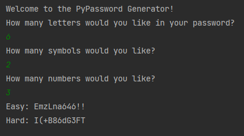

# 005-password-generator
100 Days of Code - Day 5: Password Generator

Asks for userinput about the amount of letters, symbols and numbers, then randomly picks and shuffles.

Learned:
- For loops with lists
- For loops with range()
